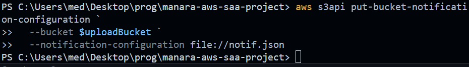

# AWS SAA MANARA - Steps

# AWS Solutions Architect Associate - MANARA Project Guide

A step-by-step implementation guide for building a serverless image processing application using AWS services.

## Overview of Architecture

This project demonstrates a complete serverless architecture implementing:

- S3 buckets for storage
- Lambda functions for processing
- DynamoDB for data persistence
- API Gateway for RESTful interfaces
- Static website hosting for the frontend

# PART 1: S3 AND LAMBDA SETUP

## 1.1 Configuring AWS CLI

The AWS Command Line Interface (CLI) allows you to interact with AWS services from your terminal.

## 1.2 Creating S3 Buckets

S3 buckets will store our uploaded images and processed results.

## 1.3 Lambda Execution Role with S3 Privileges

Creating fine-grained IAM roles to allow Lambda to access specific S3 resources.

## 1.4 Creating the Layer for Lambda Function

Lambda layers allow you to package dependencies separately from your function code.

## 1.5 Deploying the Lambda Function

Uploading and configuring the Lambda function that will process images.

## 1.6 Granting Permission to S3 to Invoke Lambda

Configuring S3 with permissions to trigger the Lambda function when new objects are uploaded.

## 1.7 Setting Notification Configuration

Configuring S3 event notifications to trigger Lambda when new images are uploaded.

# PART 2: DYNAMODB INTEGRATION

## 2.1 Creating DynamoDB Table

Setting up a NoSQL database to store metadata about processed images.

## 2.2 Adding Permissions to Lambda Role

Extending the Lambda execution role to include DynamoDB access permissions.

## 2.3 Updating the Lambda Function

Modifying the Lambda code to store image metadata in DynamoDB.

## 2.4 Creating the Package and Updating Environment Variables

Packaging the updated Lambda function with DynamoDB integration and setting environment variables.

# PART 3: API GATEWAY IMPLEMENTATION

## 3.1 Creating Lambda Function for Presigned S3 Upload URLs

Implementing a Lambda function that generates secure, temporary URLs for direct browser uploads to S3.

## 3.2 Creating the API Gateway

Setting up a RESTful API to expose our Lambda functions to the frontend.

## 3.3 Allowing API Gateway to Call UploadAPIHandler Lambda

Configuring the necessary permissions for API Gateway to invoke Lambda functions.

## 3.4 Creating Integration

Setting up the integration between API Gateway and Lambda.

## 3.5 Creating POST Route for Presigned URLs

Implementing the endpoint that will provide presigned URLs for direct S3 uploads.

## 3.6 Deploying the API

Publishing the API to make it accessible via a public endpoint.

## 3.7 Creating Role for API Handler Lambda Function

Setting up the appropriate IAM roles and permissions for the API handler Lambda function.

# PART 4: FRONTEND IMPLEMENTATION

## 4.1 Frontend Overview

Implementing a web interface that will interact with our serverless backend.

## 4.2 Configuring Website for Public Access

Setting up S3 bucket permissions to allow public access to the static website.

## 4.3 Updating API Handler for Viewing Images

Enhancing the API to support image viewing functionality.

## 4.4 Updating Permissions

Configuring the necessary permissions for the frontend to interact with backend services.

## 4.5 Uploading Site Code

Deploying the frontend code to the S3 bucket configured for website hosting.

## 4.6 Configuring Cross-Origin Resource Sharing (CORS)

To allow the frontend website to communicate with the API Gateway and upload files directly to the S3 bucket, CORS must be configured.

### 4.6.1 Configure CORS for API Gateway

This command updates the API to allow cross-origin requests from the frontend.

### 4.6.2 Configure CORS for S3 Upload Bucket

This command applies a CORS policy to the S3 upload bucket, enabling direct browser uploads.

## 4.7 Verifying API Gateway Routes

Finally, confirm that the API Gateway is configured with the correct `POST` and `GET` routes.

