# Serverless Image Processing on AWS

This project demonstrates a complete serverless architecture for uploading, processing, and viewing images using core AWS services. It provides a hands-on guide for building a scalable and cost-effective image-handling backend.

**[Live Demo](http://manara-image-frontend.s3-website-us-east-1.amazonaws.com/)** | **[Project Steps](AWS%20SAA%20MANARA%20-%20Steps%20.md)**

> **Note**: The live demo will remain available until July 18th, 2025.

---

## Table of Contents

- [Solution Overview](#solution-overview)
- [Architecture Diagram](#architecture-diagram)
- [Live Demo](#live-demo)
- [Demo Videos](#demo-videos)
- [Deployment](#deployment)
- [License](#license)

## Solution Overview

This solution provides a fully automated, serverless pipeline for image management. Users can upload images through a static web interface hosted on Amazon S3. The frontend communicates with an Amazon API Gateway to request a secure, one-time upload URL from an AWS Lambda function. This presigned URL allows the user's browser to upload the image directly to a private S3 bucket without exposing any credentials.

Once the upload is complete, an S3 event notification triggers a second AWS Lambda function. This function processes the image using the Pillow library, resizes it, and stores the result in a separate S3 bucket for processed images. Finally, it records the image metadata, such as its name and S3 URL, into an Amazon DynamoDB table for persistence and retrieval.

This architecture is designed to be highly scalable, resilient, and cost-efficient, as it only consumes resources when images are actively being uploaded and processed.

## Architecture Diagram

The architecture is composed of a frontend application, a backend API, and a processing pipeline, all built on serverless AWS services.


You can also use the Mermaid code below in tools like Lucidchart to generate the diagram yourself:

```mermaid
graph TD
    subgraph "User and Frontend"
        User["👤 User"] -- "1. Visits website" --> Frontend["🌐 S3 Static Website"];
        Frontend -- "2. Requests secure upload URL" --> APIGW["API Gateway"];
        APIGW -- "3. Returns presigned URL" --> Frontend;
        Frontend -- "4. Uploads image directly" --> UploadBucket["S3 Upload Bucket"];
    end

    subgraph "Backend Processing"
        APIGW -- "Invokes" --> APIHandlerLambda["λ API Handler Lambda"];
        APIHandlerLambda -- "Generates presigned URL for" --> UploadBucket;
        
        UploadBucket -- "5. Triggers on new image" --> ImageProcessorLambda["λ Image Processor Lambda"];
        ImageProcessorLambda -- "6. Resizes image & saves to" --> ProcessedBucket["S3 Processed Bucket"];
        ImageProcessorLambda -- "7. Writes metadata to" --> DynamoDB["⚙️ DynamoDB Table"];
    end

    style User fill:#f9f,stroke:#333,stroke-width:2px
    style Frontend fill:#ccf,stroke:#333,stroke-width:2px
```



## Live Demo

A live version of the frontend is hosted on S3. You can access it here:

- **URL**: [http://manara-image-frontend.s3-website-us-east-1.amazonaws.com/](http://manara-image-frontend.s3-website-us-east-1.amazonaws.com/)
- **Availability**: The site will remain online until June 18th, 2024.

## Demo Videos

The following videos walk through the project setup and different components of the architecture:

- [Part 1: Lambda and S3 Setup](demoVideo/part1%20lambda%20s3%20.mp4)
- [Part 2: DynamoDB Metadata Integration](demoVideo/Part%202%20metadata%20dynamodb.mp4)
- [Part 3: API Gateway Implementation](demoVideo/Part3%20apigateaway.mp4)

## Deployment

The infrastructure for this project is deployed using PowerShell scripts that interact with the AWS CLI.

1.  **Deploy Core Infrastructure**:
    The main `deploy.ps1` script handles the creation of S3 buckets, IAM roles, Lambda functions, and frontend deployment.
    ```powershell
    ./scripts/deploy.ps1
    ```

2.  **Deploy API**:
    The `deploy-api.ps1` script sets up the API Gateway endpoints and integrates them with the Lambda functions.
    ```powershell
    ./scripts/deploy-api.ps1
    ```

For a detailed breakdown of each step, please refer to the [step-by-step guide](AWS%20SAA%20MANARA%20-%20Steps%20.md).

## License

This project is licensed under the Apache-2.0 License. See the [LICENSE](./LICENSE) file for more details.
Copyright Amazon.com, Inc. or its affiliates. All Rights Reserved.
SPDX-License-Identifier: Apache-2.0 
